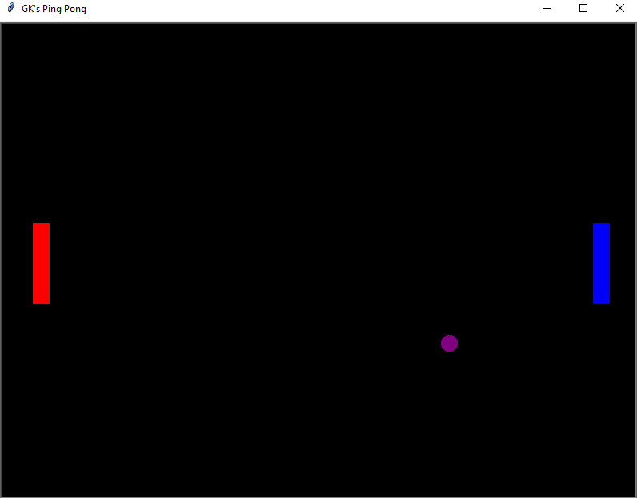

# Multiplayer-Pong

This is a simple 2 player Pong game created using the turtle module in Python. The right paddle (blue) is controlled using the "Up" and "Down" keys. The left paddle (red) 
is controlled using the "W" and "S" keys.
